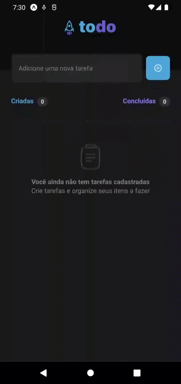
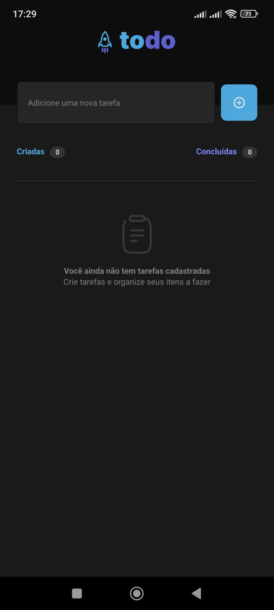
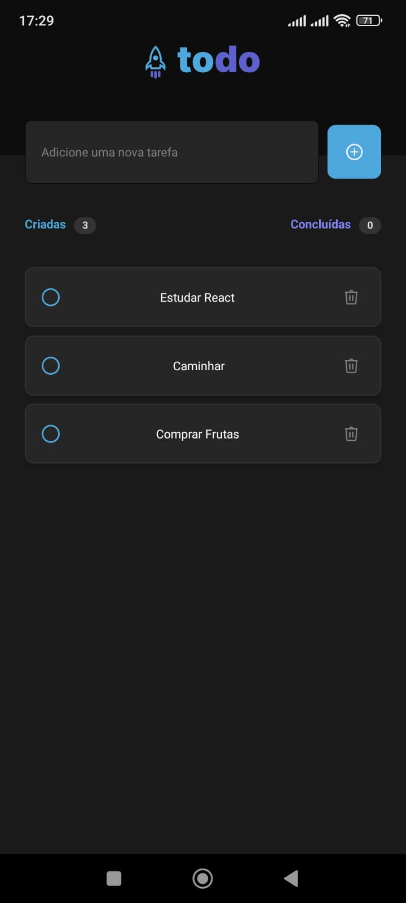
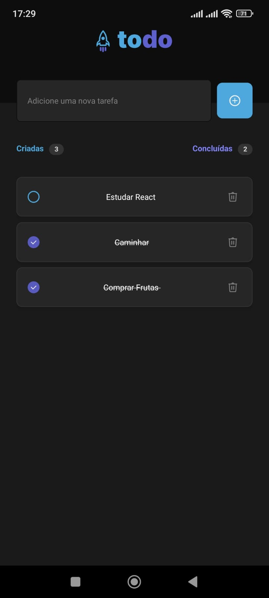
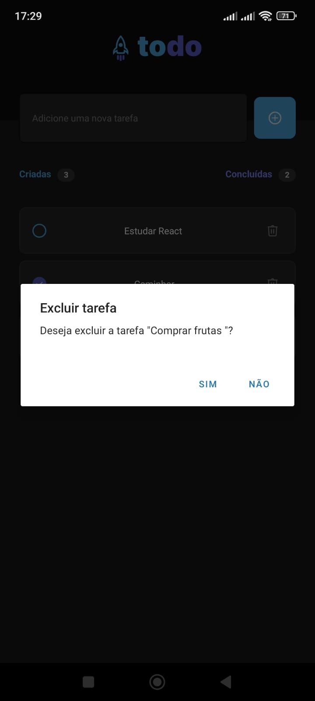
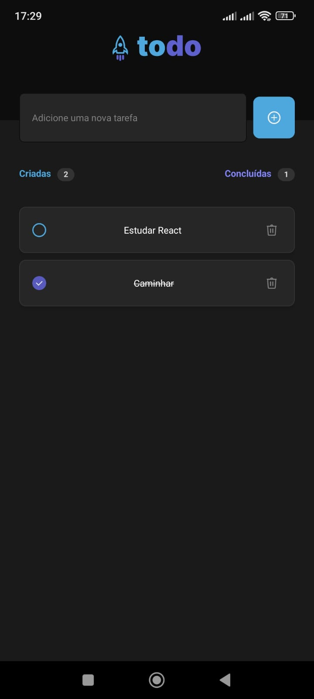

<h1 align="center" style="color: #8284FA">ToDo List</h1>

Lista de Tarefas Mobile

  <a href="#tecnologias" style="color: #8284FA">Tecnologias</a>&nbsp;&nbsp;&nbsp;|&nbsp;&nbsp;&nbsp;
  <a href="#funcionalidades" style="color: #8284FA">Funcionalidades</a>&nbsp;&nbsp;&nbsp;|&nbsp;&nbsp;&nbsp;
  <a href="#projeto" style="color: #8284FA">Projeto</a>&nbsp;&nbsp;&nbsp;|&nbsp;&nbsp;&nbsp;
  <a href="#como-executar" style="color: #8284FA">Como executar</a>&nbsp;&nbsp;&nbsp;|&nbsp;&nbsp;&nbsp;
  <a href="#licença" style="color: #8284FA">Licença</a>

 

<h3 align="center" style="color: #8284FA">Visualização do Projeto</h3>

  

  

  

  

  

  

<h2 id="tecnologias" style="color: #8284FA">🚀 Tecnologias</h2>

Esse projeto foi desenvolvido com as seguintes tecnologias:

- React Native
- TypeScript
- react-native-uuid
- SVG para ícones personalizados
- Componentes estilizados com StyleSheet

<h2 id="funcionalidades" style="color: #8284FA">✨ Funcionalidades</h2>

- Adição de novas tarefas
- Remoção de tarefas com confirmação
- Marcação de tarefas como concluídas
- Contador de tarefas criadas e concluídas
- Interface intuitiva
- Lista vazia com componente personalizado
- Rolagem suave da lista de tarefas

<h2 id="projeto" style="color: #8284FA">💻 Projeto</h2>

O ToDo List é um aplicativo mobile desenvolvido para ajudar os usuários a gerenciar suas tarefas diárias. Com uma interface limpa e intuitiva, os usuários podem adicionar, remover e marcar tarefas como concluídas, além de visualizar o progresso através dos contadores de tarefas criadas e concluídas.

<h3 id="como-executar" style="color: #8284FA">🔖 Como executar em disposito Android</h3>

 <h3 style="color: #4EA8DE">
📂 Clone este repositório
 </h3>

- git clone https://github.com/seu-usuario/todo-list.git 
- Instale as dependências
- Execute o projeto `npm start`
- Caso queira rodar o projeto no Android Studio, execute `npm run android`

 <h3 style="color: #4EA8DE">
 ⚠️ Requisitos
 </h3>

- Node.js
- JDK 11 ou superior
- Android Studio (para Android)

 <h3 style="color: #4EA8DE">
 🔧 Problemas comuns
 </h3>

Se encontrar algum erro:
- Limpe o cache do Metro:
`npm start -- --reset-cache`

<h2 id="licença" style="color: #8284FA">📝 Licença</h2>

Esse projeto está sob a licença MIT.

